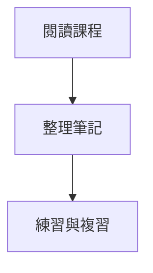

# WikiTree Markdown 功能示範

這份筆記可用來試看 **粗體**、*斜體*、清單與分隔線。

- 第一個重點
- 第二個重點

---

> [!TIP] 學習提醒
> **先理解，再練習。** 點擊提醒框可以編輯內容。

## 數學公式

行內公式：$E = mc^2$。

$$
\sum_{i=1}^{n} i = \frac{n(n+1)}{2}
$$

## 流程圖

## 表格

| 主題 | 狀態 |
| --- | --- |
| Markdown | 已整理 |
| 公式與流程圖 | 待複習 |

程式碼中的 `$x$` 應維持原文。
